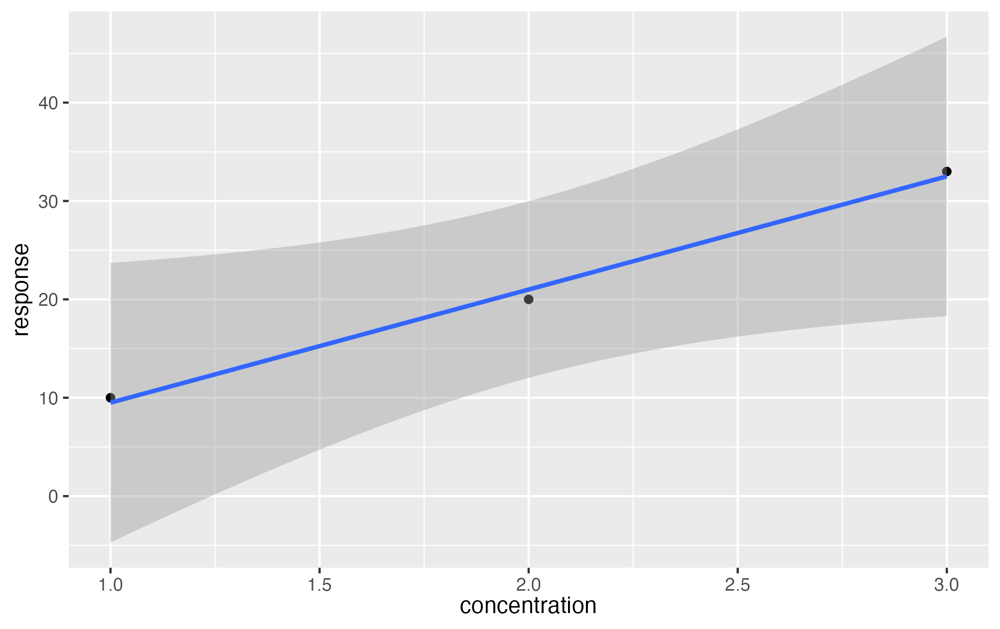

This report summarizes the results of a linear regression calibration model, 

$$
\hat{y} = m \hat{x} + b
$$

### Model Coefficients

- **Slope**: `r params$slope`
- **Intercept**: `r params$intercept`
- **R-squared**: `r params$r_squared`

### Detection Limits

- **Limit of Detection (LOD)**: `r params$lod`
- **Limit of Quantification (LOQ)**: `r params$loq`

### Statistical Significance

- **p value (Slope)**: `r params$p_slope`
- **p value (Intercept)**: `r params$p_intercept`

{width=100%, height=100%}

## Residuals

{width=100%, height=100%}

